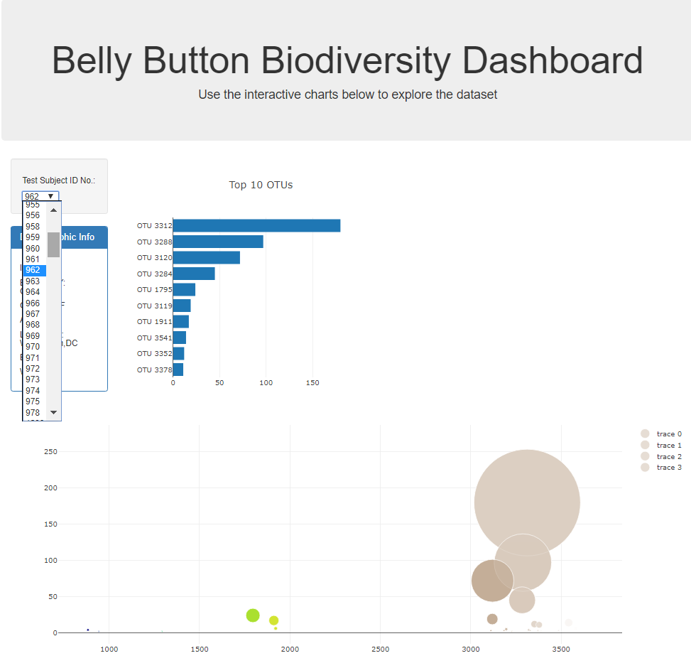

# Belly-Button-Biodiversity

## **Objective:**
The objective of this project is to use Plotly to build an interactive dashboard to present data stored in a JSON file. The dataset contains information on microbes, also called operational taxonomic units or OTUs, found inside more than 70% of people. Coded using Javascript, D3, and Plot.ly based on a json database.

The information for one individual is displayed in the dashboard and is updated each time a new test subject ID number is selected in the dropdown menu. The following information is presented in the dashboard:
* Text box: Demographic information.
* Horizontal bar graph: Top 10 OTUs.
* Bubble chart: All OTUs.

## **Tools:**
1.	HTML
2.	JavaScript - D3, Plotly

## **Screenshot:**

